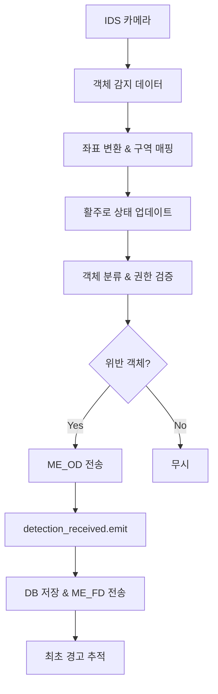

# 출입 제어 시스템 구현 가이드

## 개요

공항 관제 시스템의 출입 제어 기능은 실시간으로 감지된 객체를 **위험요소**와 **출입 대상**으로 분류하여, 구역별 권한 설정에 따라 출입 위반을 판별하는 시스템입니다. 이 문서는 실제 구현된 코드의 동작 방식과 세부 구현 내용을 설명합니다.

## 시스템 아키텍처

### 전체 처리 흐름


### 핵심 컴포넌트

#### 1. DetectionCommunicator (tcp_stream.py)
- **역할**: TCP 통신 및 출입 제어 핵심 로직
- **주요 기능**:
  * 객체 감지 데이터 수신 (포트 5000)
  * 좌표 변환 (픽셀 → 맵 좌표)
  * 구역 매핑 및 권한 검증
  * ME_OD/ME_FD 전송
  * AC_ 명령어 처리

#### 2. DetectionProcessor (detection_processor.py)
- **역할**: DB 저장 및 최초 경고 추적
- **주요 기능**:
  * 위반 객체 DB 저장
  * 최초 경고 객체 필터링 (`alerted_object_ids`)
  * 이미지 크롭 및 저장

## 객체 분류 시스템

### 1. 객체 타입별 처리 방식

```python
# 위험요소: 즉시 경고 (권한 검증 없음)
DANGEROUS_OBJECTS = ['FOD', 'BIRD', 'ANIMAL']

# 출입 대상: 권한 검증 필요
ACCESS_OBJECTS = ['PERSON', 'VEHICLE', 'WORK_PERSON', 'WORK_VEHICLE']

# 정상 운영: 경고하지 않음
NORMAL_OBJECTS = ['AIRCRAFT', 'AIRPLANE']
```

### 2. 권한 레벨 체계

| 레벨 | 명칭 | 일반용 | 작업용 | 설명 |
|------|------|--------|--------|------|
| 1 | OPEN | ✅ 허용 | ✅ 허용 | 모든 접근 허용 |
| 2 | AUTH_ONLY | ❌ 위반 | ✅ 허용 | 작업용만 허가 |
| 3 | NO_ENTRY | ❌ 위반 | ❌ 위반 | 모든 접근 금지 |

## 핵심 구현 코드

### 1. 권한 검증 로직

```python
def _process_detection_with_access_control(self, detections):
    """출입 제어를 고려한 감지 결과 처리 및 ME_OD 전송"""
    if not detections:
        return []
    
    # 객체 분류
    dangerous_objects = []   # 위험요소 (FOD, 새, 동물)
    access_objects = []      # 출입위반 (사람, 차, 작업차, 작업자)
    
    for det in detections:
        obj_class = det.get('class', '').upper()
        
        # 위험요소: FOD, 새, 동물
        if obj_class in ['FOD', 'BIRD', 'ANIMAL']:
            det['event_type'] = 1  # HAZARD
            dangerous_objects.append(det)
        
        # 출입 대상: 사람, 차, 작업차, 작업자
        elif obj_class in ['PERSON', 'VEHICLE', 'WORK_PERSON', 'WORK_VEHICLE']:
            det['event_type'] = 2  # UNAUTH (임시)
            access_objects.append(det)
        
        # 항공기는 정상 운영 객체 - 경고하지 않음
        elif obj_class in ['AIRCRAFT', 'AIRPLANE']:
            continue  # ME_OD 전송하지 않음
    
    # 위험요소는 바로 전송 대상에 추가
    final_objects_to_send = dangerous_objects.copy()
    
    # 출입위반 객체는 권한 검증 후 추가
    for det in access_objects:
        obj_class = det.get('class', '').upper()
        area_id = det.get('area_id')
        
        if area_id is None:
            # 구역을 알 수 없으면 위반으로 간주
            final_objects_to_send.append(det)
            continue
        
        # 해당 구역의 권한 레벨 확인
        authority_level = self.access_cache.get(area_id, 2)  # 기본값: AUTH_ONLY
        
        # 권한 레벨에 따른 판단
        if authority_level == 1:  # OPEN: 모든 접근 허용
            continue  # ME_OD 전송하지 않음
        
        elif authority_level == 2:  # AUTH_ONLY: 작업용만 허가
            if obj_class in ['WORK_PERSON', 'WORK_VEHICLE']:
                continue  # 작업용은 허용
            else:
                final_objects_to_send.append(det)  # 일반용은 위반
        
        elif authority_level == 3:  # NO_ENTRY: 모든 접근 금지
            final_objects_to_send.append(det)
    
    # 최종 ME_OD 전송 (위험요소 + 출입위반)
    if final_objects_to_send:
        self._send_to_gui(final_objects_to_send)
    
    return final_objects_to_send
```

### 2. 최초 경고 추적 시스템

```python
class DetectionProcessor(QThread):
    def __init__(self, video_processor=None):
        super().__init__()
        # 경고 전송된 객체 ID 추적 (메모리 캐시)
        self.alerted_object_ids = set()
    
    def process_detection(self, detection_data):
        """검출 결과 처리"""
        detections = detection_data['detections']
        
        # 최초 경고된 객체들만 필터링
        new_detections = []
        for detection in detections:
            object_id = detection['object_id']
            if object_id not in self.alerted_object_ids:
                new_detections.append(detection)
                self.alerted_object_ids.add(object_id)  # 경고 목록에 추가
        
        # 최초 경고된 객체들에 대해서만 DB 저장
        if new_detections and self.video_processor:
            # DB 저장 및 ME_FD 전송
            pass
```

### 3. 캐시 시스템

```python
def __init__(self, repository=None):
    # 출입 권한 캐시 (성능 최적화)
    self.access_cache = {}
    self.cache_timestamp = None
    
    # 시스템 시작 시 DB에서 권한 설정 로드
    self._load_access_conditions_from_db()

def _load_access_conditions_from_db(self):
    """DB에서 출입 조건을 로드하여 캐시에 저장"""
    try:
        conn = pymysql.connect(
            host=config.DB_HOST, port=config.DB_PORT,
            user=config.DB_USER, password=config.DB_PASSWORD,
            database=config.DB_NAME, charset='utf8'
        )
        with conn.cursor() as cur:
            cur.execute("SELECT area_id, authority_level_id FROM ACCESS_CONDITIONS")
            for row in cur.fetchall():
                area_id, authority_level = row
                self.access_cache[area_id] = authority_level
        
        self.cache_timestamp = datetime.now()
        print(f"[INFO] 출입 조건 로드 완료: {self.access_cache}")
    except Exception as e:
        print(f"[ERROR] 출입 조건 로드 실패: {e}")
        # 기본값으로 초기화
        for area_id in range(1, 9):
            self.access_cache[area_id] = 2  # AUTH_ONLY
```

## AC_ 명령어 프로토콜

### 1. AC_AC (권한 조회)

**요청**: `AC_AC`
**응답**: `AH_AC:level1,level2,level3,level4,level5,level6,level7,level8`

```python
def _handle_ac_ac(self) -> str:
    """AC_AC 명령 처리: 8개 구역의 권한 레벨 조회"""
    try:
        levels = []
        for area_id in range(1, 9):
            level = self.access_cache.get(area_id, 2)  # 기본값: AUTH_ONLY
            levels.append(str(level))
        
        response = "AH_AC:" + ",".join(levels)
        print(f"[INFO] AC_AC 처리 완료: {response}")
        return response
    except Exception as e:
        print(f"[ERROR] AC_AC 처리 실패: {e}")
        return "AH_AC:ERROR"
```

### 2. AC_UA (권한 업데이트)

**요청**: `AC_UA:level1,level2,level3,level4,level5,level6,level7,level8`
**응답**: `AH_UA:OK` 또는 `AH_UA:ERROR`

```python
def _handle_ac_ua(self, levels_str: str) -> str:
    """AC_UA 명령 처리: 8개 구역의 권한 레벨 업데이트"""
    try:
        levels = levels_str.split(',')
        if len(levels) != 8:
            return "AH_UA:ERROR"
        
        # DB 업데이트
        conn = pymysql.connect(
            host=config.DB_HOST, port=config.DB_PORT,
            user=config.DB_USER, password=config.DB_PASSWORD,
            database=config.DB_NAME, charset='utf8'
        )
        
        with conn.cursor() as cur:
            for i, level_str in enumerate(levels):
                area_id = i + 1
                authority_level = int(level_str)
                
                # 유효성 검증
                if authority_level not in [1, 2, 3]:
                    return "AH_UA:ERROR"
                
                # DB 업데이트
                cur.execute("""
                    INSERT INTO ACCESS_CONDITIONS (area_id, authority_level_id) 
                    VALUES (%s, %s)
                    ON DUPLICATE KEY UPDATE authority_level_id = %s
                """, (area_id, authority_level, authority_level))
                
                # 캐시 업데이트
                self.access_cache[area_id] = authority_level
        
        conn.commit()
        conn.close()
        
        print(f"[INFO] AC_UA 처리 완료: {self.access_cache}")
        return "AH_UA:OK"
    except Exception as e:
        print(f"[ERROR] AC_UA 처리 실패: {e}")
        return "AH_UA:ERROR"
```

## 메시지 프로토콜

### 1. ME_OD (실시간 객체 정보)

**형식**: `ME_OD:object_id,class,map_x,map_y,area_name[,rescue_level];...`

```python
def _send_to_gui(self, detections):
    """GUI로 검출 결과 전송"""
    if not detections:
        return
        
    gui_messages = []
    for det in detections:
        map_x = det.get('map_x')
        map_y = det.get('map_y')
        area_id = det.get('area_id')
        area_name = self.area_id_to_name.get(area_id, 'UNKNOWN')
        
        gui_msg = f"{det['object_id']},{det['class'].upper()},{int(map_x)},{int(map_y)},{area_name}"
        
        # PERSON 객체는 rescue_level 추가
        if det['class'].upper() == 'PERSON':
            rescue_level = det.get('rescue_level', 0)
            gui_msg += f",{rescue_level}"
        
        gui_messages.append(gui_msg)
    
    message = "ME_OD:" + ";".join(gui_messages) + "\n"
    self.gui_server.send_binary_to_client(message.encode())
```

### 2. ME_FD (최초 감지 알림)

**형식**: `ME_FD:event_type,object_id,class,map_x,map_y,area_name,timestamp[,rescue_level],image_size,<binary_data>`

```python
def send_first_detection_to_gui(self, detections, crop_imgs):
    """최초 감지된 객체에 대해 ME_FD 메시지 생성 및 전송"""
    timestamp = datetime.utcnow().strftime('%Y-%m-%dT%H:%M:%SZ')
    
    for det, img_binary in zip(detections, crop_imgs):
        object_id = det['object_id']
        object_class = det['class'].upper()
        map_x = det.get('map_x')
        map_y = det.get('map_y')
        area_id = det.get('area_id')
        area_name = self.area_id_to_name.get(area_id, 'UNKNOWN')
        event_type_id = det.get('event_type', 1)  # 권한 검증 결과 반영
        
        if object_class == 'PERSON':
            # 사람: rescue_level 포함
            rescue_level = det.get('rescue_level', 0)
            gui_msg_header = f"{event_type_id},{object_id},{object_class},{int(map_x)},{int(map_y)},{area_name},{timestamp},{rescue_level},{len(img_binary)}"
        else:
            # 비사람: rescue_level 없음
            gui_msg_header = f"{event_type_id},{object_id},{object_class},{int(map_x)},{int(map_y)},{area_name},{timestamp},{len(img_binary)}"
        
        gui_msg = gui_msg_header.encode() + b"," + img_binary
        self.gui_server.send_binary_to_client(b"ME_FD:" + gui_msg)
```

## 이미지 저장 시스템

### 고유 파일명 생성

```python
def save_cropped_frame(self, frame, detection, img_id):
    """검출된 객체 영역을 크롭하여 이미지 파일로 저장"""
    bbox = detection.get('bbox', [])
    if not bbox or len(bbox) != 4:
        return False
    
    x1, y1, x2, y2 = map(int, bbox)
    cropped_frame = frame[y1:y2, x1:x2]
    
    # 고유 파일명 생성 (타임스탬프 포함)
    img_dir = os.path.join(os.path.dirname(os.path.dirname(os.path.abspath(__file__))), 'img')
    os.makedirs(img_dir, exist_ok=True)
    filename = f"img_{detection['object_id']}_{datetime.now().strftime('%Y%m%d%H%M%S')}.jpg"
    filepath = os.path.join(img_dir, filename)
    
    result = cv2.imwrite(filepath, cropped_frame)
    if result:
        print(f"[INFO] 이미지 저장 완료: {filename}")
        return True
    else:
        print(f"[ERROR] 이미지 저장 실패: {filename}")
        return False
```

## 성능 최적화

### 1. 메모리 관리

```python
# 경고 추적 메모리 사용량
# 1000개 객체 ID = 약 8KB (정수 set)
# O(1) 검색 성능으로 실시간 처리 가능
self.alerted_object_ids = set()

# 권한 캐시 (8개 구역)
# 메모리 사용량: 약 200B
# DB 조회 없이 즉시 권한 확인
self.access_cache = {1: 2, 2: 2, ..., 8: 2}
```

### 2. 네트워크 최적화

```python
# 이미지 압축 (4KB 초과 시)
if len(img_binary) > 4000:
    encode_param = [int(cv2.IMWRITE_JPEG_QUALITY), 85]
    _, img_binary = cv2.imencode('.jpg', img, encode_param)
    img_binary = img_binary.tobytes()
```

## 로그 및 디버깅

### 1. 권한 검증 로그

```
[DEBUG] 권한 검증: Area 3 -> 레벨 2, 객체: WORK_VEHICLE ID=1001
[INFO] 작업용 접근 허용 (AUTH_ONLY): WORK_VEHICLE ID=1001 in Area 3
[INFO] 일반용 출입 위반 (AUTH_ONLY): PERSON ID=1002 in Area 3
[INFO] 출입 위반 (NO_ENTRY): WORK_VEHICLE ID=1003 in Area 8
```

### 2. DB 저장 로그

```
[INFO] ME_FD 저장 완료: 2개 객체
[INFO] 이미지 저장 완료: img_1001_20250627143022.jpg
```

### 3. GUI 통신 로그

```
[SEND] ME_OD:1001,FOD,100,100,TWY_A;1002,PERSON,200,200,RWY_A
[SEND] ME_FD:2,1001,PERSON,100,100,TWY_A,2025-06-27T14:30:00Z,0,2048
```

## 문제 해결 가이드

### 1. 권한이 올바르게 설정되었는데 경고가 발생하는 경우

**원인**: 
- 캐시가 업데이트되지 않음
- 객체 클래스 매핑 오류

**해결**:
```bash
# 1. 캐시 상태 확인
grep "출입 조건 로드 완료" logs/*.log

# 2. 권한 설정 확인
grep "AC_UA 처리 완료" logs/*.log

# 3. 객체 분류 확인
grep "권한 검증:" logs/*.log
```

### 2. ME_FD가 중복 전송되는 경우

**원인**: 
- `alerted_object_ids` 초기화 문제
- 객체 ID 중복

**해결**:
```python
# alerted_object_ids 상태 확인
print(f"경고된 객체 수: {len(self.alerted_object_ids)}")
print(f"경고된 객체 ID: {list(self.alerted_object_ids)[:10]}")  # 최근 10개
```

### 3. 구역 매핑이 잘못되는 경우

**원인**: 
- 좌표 변환 오류
- AREA 테이블 설정 문제

**해결**:
```sql
-- AREA 테이블 확인
SELECT area_id, area_name, x1, y1, x2, y2 FROM AREA;

-- ACCESS_CONDITIONS 확인
SELECT area_id, authority_level_id FROM ACCESS_CONDITIONS;
```

## 확장 계획

### 1. 시간대별 권한 설정
```sql
CREATE TABLE ACCESS_SCHEDULE (
    schedule_id INT PRIMARY KEY AUTO_INCREMENT,
    area_id INT,
    authority_level_id INT,
    start_time TIME,
    end_time TIME,
    days_of_week VARCHAR(20)
);
```

### 2. 개별 객체 권한 관리
```sql
CREATE TABLE OBJECT_PERMISSIONS (
    object_id INT PRIMARY KEY,
    object_type VARCHAR(20),
    permission_level INT,
    valid_until DATETIME
);
```

### 3. 실시간 알림 시스템
- 웹소켓 기반 실시간 알림
- 모바일 푸시 알림 연동
- 이메일/SMS 알림 시스템 