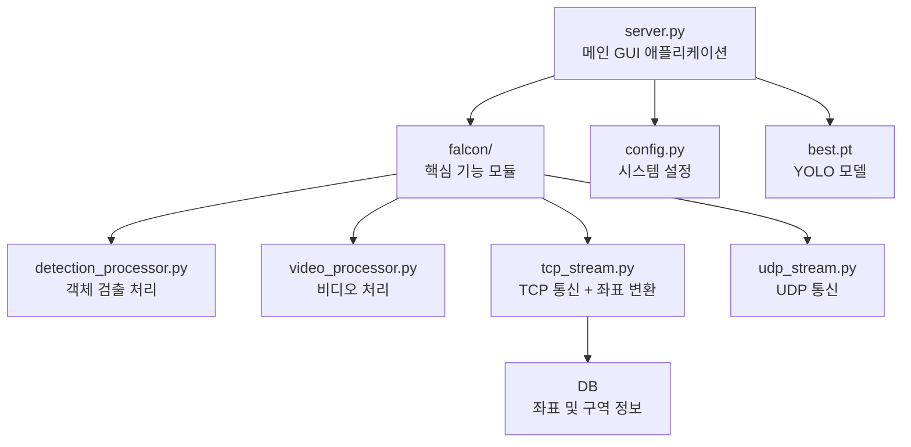
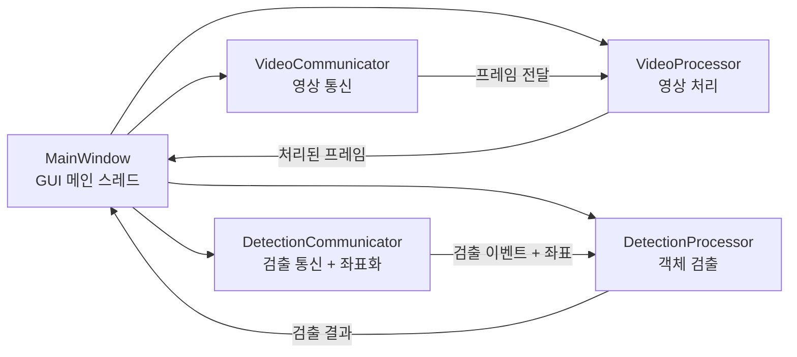
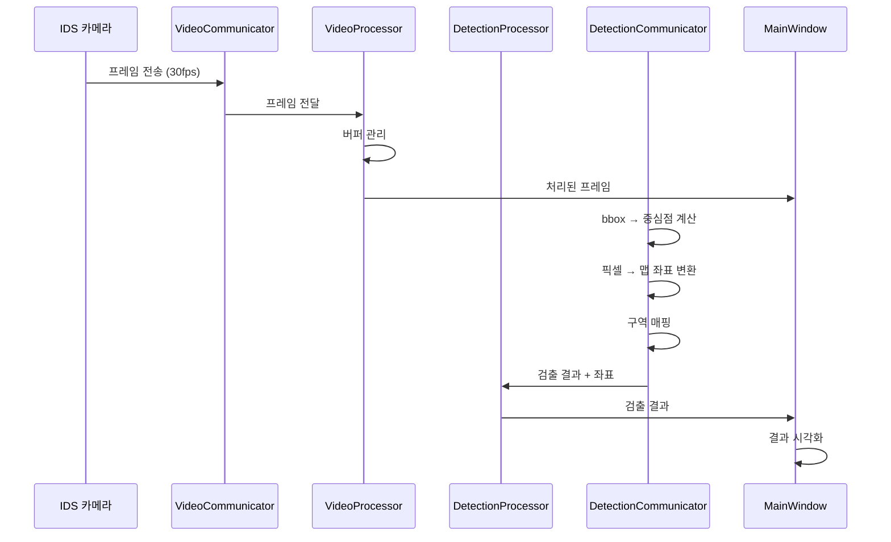

# 코드 구조 가이드

## 1. 시스템 구조

### 전체 구조


### 스레드 구조


## 2. 주요 컴포넌트

### server.py
- **역할**: GUI 기반 메인 서버 애플리케이션
- **주요 기능**:
  * 실시간 영상 표시
  * 객체 검출 결과 시각화
  * FPS 및 버퍼 상태 모니터링
  * 스레드 관리

### falcon/detection_processor.py
- **역할**: 객체 검출 결과 처리
- **주요 기능**:
  * 검출 결과 버퍼 관리
  * 바운딩 박스 시각화
  * 검출 FPS 계산
  * 이전 프레임 검출 결과 재사용

### falcon/video_processor.py
- **역할**: 비디오 프레임 처리
- **주요 기능**:
  * 프레임 버퍼 관리 (60프레임)
  * 프레임 큐 시스템
  * 비디오 FPS 계산
  * 오래된 프레임 정리

### falcon/tcp_stream.py ⭐ **핵심 좌표화 모듈**
- **역할**: TCP 기반 검출 결과 통신 + 픽셀 좌표화
- **주요 기능**:
  * 객체 검출 이벤트 수신 (포트 5000)
  * JSON 메시지 처리
  * 클라이언트 연결 관리
  * **bbox 중심점 계산**
  * **픽셀 → 정규화 → 맵 좌표 변환**
  * **구역(AREA) 매핑**
  * **DB 좌표 정보 저장**

### falcon/udp_stream.py
- **역할**: UDP 기반 영상 통신
- **주요 기능**:
  * IDS 카메라 영상 수신 (포트 4000)
  * Admin GUI로 영상 전송 (포트 4100)
  * 프레임 인코딩/디코딩

## 3. 데이터 흐름

### 영상 처리 흐름


### 좌표 변환 흐름 ⭐ **새로 추가**
```mermaid
graph LR
    A[bbox [x1,y1,x2,y2]] --> B[중심점 계산]
    B --> C[픽셀 좌표]
    C --> D[정규화 좌표 0~1]
    D --> E[맵 좌표 960x720]
    E --> F[구역 매핑]
    F --> G[DB 저장]
```

### 버퍼 관리
1. **비디오 버퍼**
   - 최대 60프레임 저장 (30fps 기준 2초)
   - FIFO(First In First Out) 방식
   - 타임스탬프 기반 동기화

2. **검출 버퍼**
   - 검출 결과 저장
   - 이전 프레임 결과 재사용
   - 200ms 이내 결과만 사용

## 4. 설정 관리 (config.py)

### 네트워크 설정
- TCP 포트:
  * 5000: 객체 검출
  * 5100: 관리자 통신
  * 5200: 조류 감지
  * 5300: 조종사 통신

- UDP 포트:
  * 4000: IDS 영상
  * 4100: 관리자 영상

### 시스템 설정
- 버퍼 크기: 60 프레임
- 기본 FPS: 30
- 기본 해상도: 640x480
- **맵 크기: 960x720 (좌표 변환용)**

## 5. 성능 고려사항

### CPU 사용량 최적화
- 스레드 대기 시간 관리
- 버퍼 크기 제한
- 주기적인 메모리 정리
- **좌표 변환 최적화 (실시간 처리)**

### 메모리 관리
- 프레임 버퍼 제한
- 오래된 데이터 자동 삭제
- 검출 결과 재사용 제한

### 네트워크 최적화
- UDP: 영상 전송 (손실 허용)
- TCP: 중요 이벤트 (신뢰성 보장)
- 버퍼 크기 조정

## 6. 픽셀 좌표화 시스템 ⭐ **새로 추가**

### 핵심 함수들
```python
# falcon/tcp_stream.py
def convert_to_map_coords(self, center_x, center_y, frame_width, frame_height):
    """bbox 중심점 → 맵 좌표 변환"""
    norm_x = center_x / frame_width
    norm_y = center_y / frame_height
    map_x = norm_x * config.MAP_WIDTH
    map_y = norm_y * config.MAP_HEIGHT
    return map_x, map_y, norm_x, norm_y

def find_area_id(self, norm_x, norm_y):
    """정규화 좌표에 해당하는 area_id 반환"""
    for area in self.area_list:
        if area['x1'] <= norm_x <= area['x2'] and area['y1'] <= norm_y <= area['y2']:
            return area['area_id']
    return None
```

### 처리 단계
1. **bbox 중심점 계산**: (x1+x2)/2, (y1+y2)/2
2. **정규화 좌표 변환**: 픽셀 → 0~1 범위
3. **맵 좌표 변환**: 정규화 → 960x720 기준
4. **구역 매핑**: 정규화 좌표로 구역 판별
5. **DB 저장**: map_x, map_y, area_id 저장

### 성능 지표
- **처리 속도**: 실시간 처리 (30 FPS 기준)
- **정확도**: 픽셀 단위 정밀 좌표 변환
- **확장성**: 구역 추가/수정 시 DB만 업데이트

## 데이터베이스 테이블 구조 및 설명

### 1. 객체 감지 및 이벤트 기록

#### DETECT_EVENT
| 필드명           | 타입         | 설명                | 예시                |
|------------------|--------------|---------------------|---------------------|
| event_id         | INT (PK)     | 이벤트 고유 ID      | 0001                |
| event_type_id    | INT (FK)     | 이벤트 타입         | 1                   |
| object_id        | INT (FK)     | 감지 객체 ID        | 0                   |
| object_type_id   | INT (FK)     | 객체 타입           | 0                   |
| map_x            | FLOAT        | 맵 X 좌표          | 700                 |
| map_y            | FLOAT        | 맵 Y 좌표          | 400                 |
| area_id          | INT (FK)     | 감지 구역           | 1                   |
| event_time       | DATETIME     | 이벤트 발생 시각     | YYYY-MM-DD HH:MM:S  |
| img_path         | VARCHAR(64)  | 이미지 경로         | 로컬/~~.jpg         |

#### DETECTED_OBJECT
| 필드명         | 타입       | 설명         |
|----------------|------------|--------------|
| object_id      | INT (PK)   | 객체 고유 ID |
| object_type_id | INT (FK)   | 객체 타입    |

#### EVENT_TYPE
| 필드명         | 타입         | 설명         | 예시      |
|----------------|--------------|--------------|-----------|
| event_type_id  | INT (PK)     | 이벤트 타입  | 1         |
| event_type_name| VARCHAR(8)   | 타입명       | HAZARD    |

#### OBJECT_TYPE
| 필드명         | 타입         | 설명         | 예시      |
|----------------|--------------|--------------|-----------|
| object_type_id | INT (PK)     | 객체 타입    | 0         |
| object_type_name| VARCHAR(16) | 타입명       | BIRD      |

#### AREA
| 필드명   | 타입         | 설명         | 예시      |
|----------|--------------|--------------|-----------|
| area_id  | INT (PK)     | 구역 ID      | 1         |
| area_name| VARCHAR(16)  | 구역명       | TWY_A     |
| x1, y1   | FLOAT        | 좌상단 좌표  |           |
| x2, y2   | FLOAT        | 우하단 좌표  |           |

#### ACCESS_CONDITIONS
| 필드명                    | 타입       | 설명                |
|---------------------------|------------|---------------------|
| area_id                   | INT (PK,FK)| 구역 ID             |
| vehicle_authority_level_id| INT (FK)   | 차량 권한 레벨      |
| person_authority_level_id | INT (FK)   | 사람 권한 레벨      |

#### AUTHORITY_LEVEL
| 필드명   | 타입         | 설명         | 예시      |
|----------|--------------|--------------|-----------|
| level_id | INT (PK)     | 권한 레벨    | 0         |
| level_name| VARCHAR(16) | 레벨명       | OPEN      |

### 2. 조류 위험도 분석

#### BIRD_RISK_LOG
| 필드명        | 타입       | 설명                |
|---------------|------------|---------------------|
| id            | INT (PK)   | 로그 ID             |
| prev_level_id | INT (FK)   | 이전 위험도 레벨    |
| curr_level_id | INT (FK)   | 현재 위험도 레벨    |
| timestamp     | DATETIME   | 변경 시각           |

#### BIRD_RISK_LEVEL
| 필드명   | 타입         | 설명         | 예시      |
|----------|--------------|--------------|-----------|
| level_id | INT (PK)     | 위험도 레벨  | 1         |
| level_name| VARCHAR(16) | 레벨명       | BR_HIGH   |

### 3. 조종사 음성 요청 자동 응답

#### INTERACTION_LOG
| 필드명        | 타입       | 설명                |
|---------------|------------|---------------------|
| id            | INT (PK)   | 로그 ID             |
| request_id    | INT (FK)   | 요청 타입           |
| response_id   | INT (FK)   | 응답 타입           |
| request_time  | DATETIME   | 요청 시각           |
| response_time | DATETIME   | 응답 시각           |
| status_id     | INT (FK)   | 처리 상태           |

#### REQUEST_TYPE
| 필드명      | 타입         | 설명         | 예시         |
|-------------|--------------|--------------|--------------|
| request_id  | INT (PK)     | 요청 타입    | 1            |
| request_code| VARCHAR(16)  | 요청 코드    | BR_INQ       |

#### RESPONSE_TYPE
| 필드명      | 타입         | 설명         | 예시         |
|-------------|--------------|--------------|--------------|
| response_id | INT (PK)     | 응답 타입    | 1            |
| response_code| VARCHAR(16) | 응답 코드    | BR_HIGH      |

#### INTERACTION_STATUS
| 필드명      | 타입         | 설명         | 예시         |
|-------------|--------------|--------------|--------------|
| status_id   | INT (PK)     | 상태 ID      | 1            |
| status_code | VARCHAR(16)  | 상태 코드    | SUCCESS      |

## 데이터 흐름 및 용도 요약
- **객체 감지 및 이벤트 기록**: 감지된 객체와 이벤트, 위치, 구역, 이미지 경로 등을 기록합니다. 각 객체와 이벤트는 타입별로 관리됩니다.
- **조류 위험도 분석**: 위험도 레벨의 변동 이력을 기록하며, 위험도 레벨은 별도 테이블로 관리됩니다.
- **조종사 음성 요청 자동 응답**: 조종사의 요청과 시스템 응답, 처리 상태를 기록합니다. 요청/응답/상태는 각각 코드 테이블로 관리됩니다.

이 구조는 공항 등에서 객체 감지, 위험도 분석, 조종사와의 상호작용 기록 등 다양한 상황에 대응할 수 있도록 설계되었습니다. 

## 6. 주요 메시지 종류 및 포맷

### 1) 객체 감지 이벤트 (상시)
- **방향**: server → GUI
- **메시지명**: ME_OD
- **예시**:  
  `ME_OD:1001,FOD,100,100,AREA_A;1002,PERSON,200,180,AREA_A,rescue`
- **설명**:  
  - 상시 객체 감지 결과를 GUI에 송신  
  - 필드: object_id, class(객체 타입), x, y(맵핑 중심좌표), area(구역), [state(사람만)]

### 2) 최초 객체 감지 이벤트 (DB 저장 시)
- **방향**: server → GUI
- **메시지명**: ME_FD
- **예시**:  
  `ME_FD:1001,FOD,100,100,AREA_A,2025-06-05T19:21:00Z,2000,$$<img_binary>`
- **설명**:  
  - DB 저장 성공 시 최초 감지 객체 정보와 이미지 바이너리 송신  
  - 필드: object_id, class, x, y, area, timestamp, [state(사람만)], image_size, image

### 3) 조류/활주로 위험도/맵 보정 이벤트
- **ME_BR:1** (조류 위험도 변경, level: 0~2)
- **ME_RA:0, ME_RB:0** (활주로 위험도, state: 0/1)
- **ME_MC** (맵 보정 완료)

### 4) 명령/응답
- **MC_CA, MC_CB, MC_MP, MC_OD:2223** (GUI→server, CCTV/지도/상세보기 요청)
- **MR_CA:OK, MR_CB:OK, MR_MP:OK** (server→GUI, 명령 응답)
- **MR_OD:OK,2223,FOD,AREA_A,2025-06-05T19:21:00Z,2000,$$<img_binary>** (상세보기 응답)

### 5) 필드 설명/매핑
- **object_id**: DETECT_EVENT.object_id
- **class**: OBJECT_TYPE.object_type_name (항상 대문자)
- **area**: AREA.area_name
- **state**: 사람만, rescue/none (DB에는 없음, 서버에서 판단)
- **timestamp**: ISO 8601, DB event_time과 매핑
- **image_size/image**: 이미지 바이너리 크기/실제 데이터 