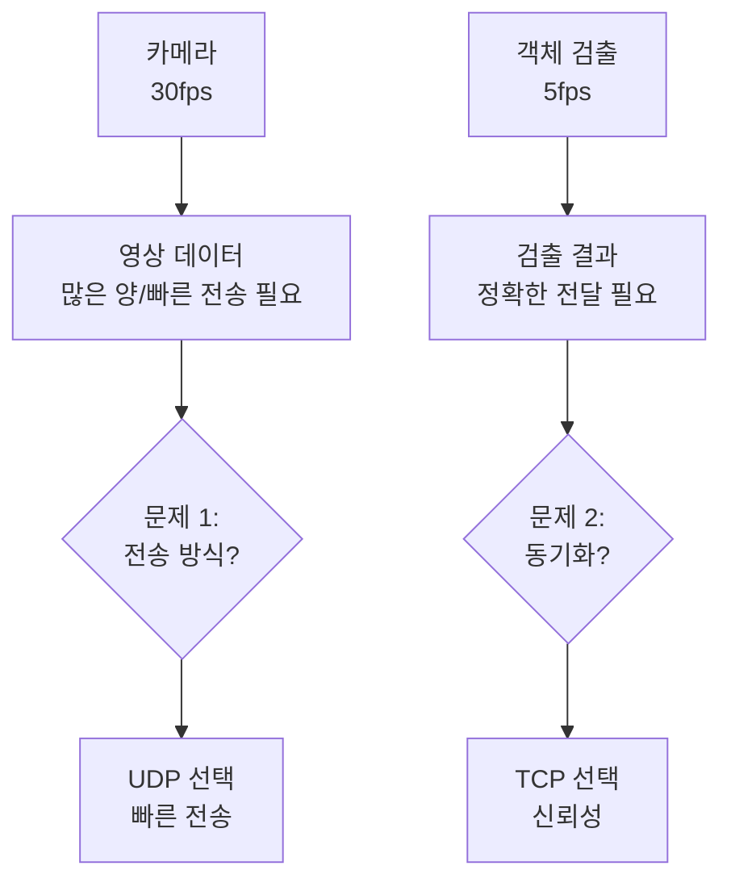
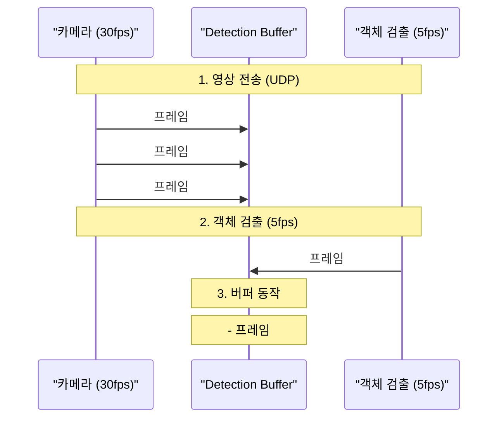
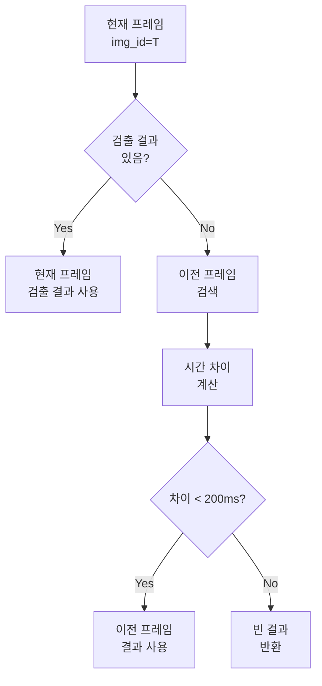

# Detection Buffer Guide

## 1. 시스템 개요

### 문제 상황


### 해결 방안
1. **두 가지 전송 프로토콜 사용**
   - 영상: UDP (빠른 전송, 일부 손실 허용)
   - 검출 결과: TCP (신뢰성 있는 전송)

2. **타임스탬프 기반 동기화**
   - 모든 프레임에 나노초 단위 타임스탬프 부여
   - 검출 결과도 동일한 타임스탬프로 매칭

### 전체 흐름


## 2. 데이터 포맷

### UDP 비디오 프레임
```
형식: {카메라ID}:{타임스탬프}:{JPEG데이터}
예시: A:1749663684188088445:JPEG_DATA
```

### TCP 검출 결과
```json
{
    "type": "event",
    "event": "object_detected",
    "camera_id": "A",
    "img_id": 1749663684188088445,  // 나노초 타임스탬프
    "detections": [
        {
            "object_id": 1000,  // 프레임 내 첫 번째 객체
            "class": "animal",
            "bbox": [x1, y1, x2, y2],
            "confidence": 0.92
        }
    ]
}
```

## 3. 버퍼 동작 방식

### 단계별 동작
1. **프레임 수신** (UDP)
   ```python
   # 프레임마다 고유 타임스탬프 생성
   img_id = time.time_ns()  # 예: 1749663684188088445
   ```

2. **검출 결과 수신** (TCP)
   ```python
   # 프레임과 동일한 타임스탬프로 검출 결과 매칭
   detection_data = {
       "img_id": img_id,
       "detections": [...]
   }
   ```

3. **버퍼 처리**
   ```python
   if img_id in detection_buffer:
       # 해당 프레임의 검출 결과가 있으면 사용
       detections = detection_buffer[img_id]
   else:
       # 없으면 가장 가까운 이전 타임스탬프의 결과 사용
       prev_id = find_closest_previous_frame(img_id)
       detections = detection_buffer[prev_id]
   ```

### 실제 예시
```
시간순 데이터 흐름:

1. 프레임 수신 (UDP, 30fps)
   t=000ns: 프레임 #1
   t=033ns: 프레임 #2
   t=066ns: 프레임 #3
   t=099ns: 프레임 #4

2. 검출 결과 수신 (TCP, 5fps)
   t=000ns: 프레임 #1 → 3마리 감지
   t=200ns: 프레임 #6 → 2마리 감지

3. 버퍼 처리
   프레임 #1: t=000ns의 검출 결과 사용 (직접 매칭)
   프레임 #2: t=000ns의 검출 결과 사용 (이전 프레임)
   프레임 #3: t=000ns의 검출 결과 사용 (이전 프레임)
   프레임 #4: t=000ns의 검출 결과 사용 (이전 프레임)
   프레임 #5: t=000ns의 검출 결과 사용 (이전 프레임)
   프레임 #6: t=200ns의 검출 결과 사용 (직접 매칭)
```

## 4. 주의사항
1. **타임스탬프 정밀도**
   - 나노초 단위 사용 (time.time_ns())
   - 밀리초나 마이크로초는 부정확할 수 있음

2. **버퍼 관리**
   - 오래된 데이터 정리 필요
   - 메모리 사용량 모니터링

3. **네트워크 고려사항**
   - UDP: 패킷 손실 허용
   - TCP: 연결 끊김 대비 필요 

## 5. 바운딩 박스 처리 알고리즘

### 바운딩 박스 시각화
```python
def draw_detections(frame, detections):
    """
    프레임에 검출 결과를 시각화
    
    Args:
        frame: numpy array, 원본 이미지
        detections: list, 검출 결과 목록
    """
    for det in detections:
        # 1. 박스 좌표 추출
        x1, y1, x2, y2 = det['bbox']
        
        # 2. 박스 그리기 (녹색, 2픽셀 두께)
        cv2.rectangle(frame, (x1, y1), (x2, y2), (0, 255, 0), 2)
        
        # 3. 레이블 표시
        label = f"{det['class']}: {det['confidence']:.2f}"
        
        # 4. 레이블 배경 그리기
        (w, h), _ = cv2.getTextSize(label, cv2.FONT_HERSHEY_SIMPLEX, 0.5, 2)
        cv2.rectangle(frame, (x1, y1-h-10), (x1+w, y1), (0, 255, 0), -1)
        
        # 5. 텍스트 그리기 (검은색)
        cv2.putText(frame, label, (x1, y1-5),
                   cv2.FONT_HERSHEY_SIMPLEX, 0.5, (0, 0, 0), 2)
```

### 이전 프레임 검출 결과 재사용 로직



#### 1. 시간 기반 매칭
```python
def find_closest_previous_frame(current_img_id):
    """
    가장 가까운 이전 프레임의 검출 결과 찾기
    
    Args:
        current_img_id: int, 현재 프레임의 타임스탬프
    Returns:
        int or None: 가장 가까운 이전 프레임의 타임스탬프
    """
    closest_id = None
    min_diff = float('inf')
    
    # 버퍼에서 가장 가까운 이전 프레임 찾기
    for img_id in detection_buffer.keys():
        if img_id < current_img_id:  # 이전 프레임만 고려
            time_diff = current_img_id - img_id
            if time_diff < min_diff:
                min_diff = time_diff
                closest_id = img_id
    
    # 200ms(200_000_000ns) 이내의 결과만 사용
    if min_diff <= 200_000_000:
        return closest_id
    return None
```

#### 2. 검출 결과 재사용 기준
- **시간 임계값**: 200ms (0.2초)
  - 이유: 객체 검출이 5fps(200ms)로 동작하므로
  - 이 시간을 초과하면 객체 위치가 크게 달라질 수 있음

- **재사용 규칙**:
  ```
  1. 현재 프레임(T)에 검출 결과가 있으면 그대로 사용
  
  2. 검출 결과가 없을 때:
     A. T-200ms 이내의 가장 가까운 이전 프레임 찾기
     B. 해당 프레임의 검출 결과 재사용
     C. 200ms 이상 차이나면 빈 결과 반환
  
  예시:
  T+000ms: 프레임 #1 (검출 O) → 직접 사용
  T+033ms: 프레임 #2 (검출 X) → #1 재사용 (△t=33ms)
  T+066ms: 프레임 #3 (검출 X) → #1 재사용 (△t=66ms)
  T+250ms: 프레임 #8 (검출 X) → 빈 결과 (△t>200ms)
  ```

#### 3. 성능 최적화
- **버퍼 정리**: 200ms 이상 지난 검출 결과는 자동 삭제
  ```python
  def cleanup_old_detections():
      current_time = time.time_ns()
      old_threshold = 200_000_000  # 200ms in nanoseconds
      
      # 오래된 결과 삭제
      old_keys = [k for k in detection_buffer.keys() 
                 if current_time - k > old_threshold]
      for k in old_keys:
          del detection_buffer[k]
  ```

- **실제 구현**:
  ```python
  def process_detection(self, detection_data):
      """검출 결과 처리
      Args:
          detection_data (dict): {
              'img_id': int,  # 이미지 ID
              'detections': list  # 검출 결과 리스트
          }
      """
      if not detection_data or 'detections' not in detection_data:
          return
      
      img_id = detection_data['img_id']
      detections = detection_data['detections']
      
      # 검출 결과 버퍼에 저장
      self.detection_buffer[img_id] = detections
      
      # 마지막 검출 결과 업데이트
      self.last_detection = detections
      self.last_detection_img_id = img_id
  ``` 