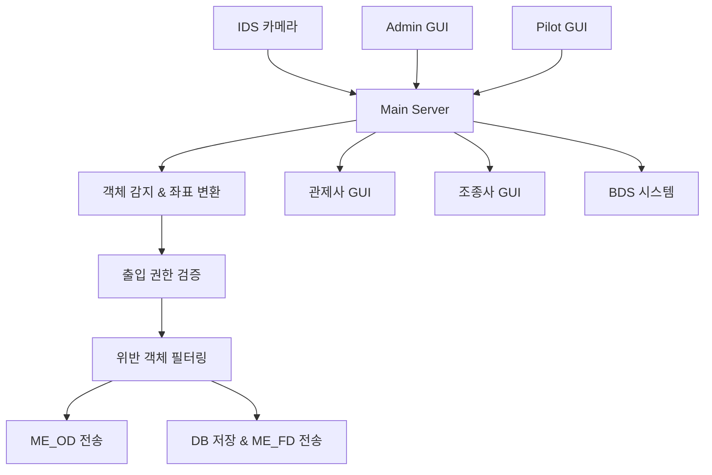
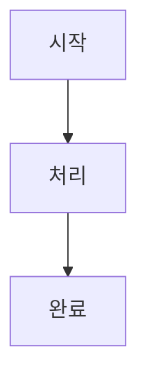

# 공항 관제 시스템 문서 가이드

## 📋 문서 개요

이 폴더는 공항 관제 시스템의 전체 기능과 구현에 대한 상세 문서를 포함합니다.

## 🗂️ 문서 구조

### 🏗️ 시스템 아키텍처
- [`code_structure.md`](./code_structure.md) - 전체 코드 구조 및 컴포넌트 설명
- [`communication_guide.md`](./communication_guide.md) - 시스템 간 통신 프로토콜 가이드

### 🔐 출입 제어 시스템
- [`access_control_guide.md`](./access_control_guide.md) - 출입 제어 시스템 개요
- [`access_control_implementation_guide.md`](./access_control_implementation_guide.md) - 출입 제어 시스템 실제 구현 가이드

### 📍 좌표 및 구역 관리
- [`area_mapping_guide.md`](./area_mapping_guide.md) - 구역 매핑 및 좌표 변환 시스템
- [`pixel_coordinate_progress_report.md`](./pixel_coordinate_progress_report.md) - 픽셀 좌표화 개발 진행 보고서

### 🎯 객체 감지 및 처리
- [`detection_buffer_guide.md`](./detection_buffer_guide.md) - 검출 버퍼 시스템 동작 원리
- [`image_save_guide.md`](./image_save_guide.md) - 이미지 저장 시스템

### 🗄️ 데이터베이스
- [`db_structure_guide.md`](./db_structure_guide.md) - 데이터베이스 구조 및 테이블 설명

### 📡 통신 프로토콜
- [`controller_protocol.md`](./controller_protocol.md) - 관제사 GUI 통신 프로토콜
- [`pilot_protocol.md`](./pilot_protocol.md) - 조종사 GUI 통신 프로토콜
- [`ids_protocol.md`](./ids_protocol.md) - IDS 카메라 통신 프로토콜
- [`bds_protocol.md`](./bds_protocol.md) - BDS 조류 감지 시스템 프로토콜

## 🚀 빠른 시작 가이드

### 1. 시스템 이해하기
1. [`code_structure.md`](./code_structure.md) - 전체 시스템 구조 파악
2. [`communication_guide.md`](./communication_guide.md) - 통신 흐름 이해

### 2. 출입 제어 시스템
1. [`access_control_guide.md`](./access_control_guide.md) - 기본 개념 이해
2. [`access_control_implementation_guide.md`](./access_control_implementation_guide.md) - 실제 구현 내용

### 3. 좌표 시스템
1. [`area_mapping_guide.md`](./area_mapping_guide.md) - 구역 매핑 원리
2. [`pixel_coordinate_progress_report.md`](./pixel_coordinate_progress_report.md) - 좌표 변환 세부사항

### 4. 데이터 처리
1. [`detection_buffer_guide.md`](./detection_buffer_guide.md) - 검출 버퍼 동작
2. [`db_structure_guide.md`](./db_structure_guide.md) - 데이터베이스 구조

## 📊 시스템 구성도



## 🔧 주요 기능별 문서

### 출입 제어 (Access Control)
- **개요**: [`access_control_guide.md`](./access_control_guide.md)
- **구현**: [`access_control_implementation_guide.md`](./access_control_implementation_guide.md)
- **관련 프로토콜**: [`controller_protocol.md`](./controller_protocol.md)

### 좌표 변환 (Coordinate Mapping)
- **구역 매핑**: [`area_mapping_guide.md`](./area_mapping_guide.md)
- **픽셀 좌표화**: [`pixel_coordinate_progress_report.md`](./pixel_coordinate_progress_report.md)
- **시스템 구조**: [`code_structure.md`](./code_structure.md)

### 객체 감지 (Object Detection)
- **버퍼 시스템**: [`detection_buffer_guide.md`](./detection_buffer_guide.md)
- **이미지 저장**: [`image_save_guide.md`](./image_save_guide.md)
- **IDS 프로토콜**: [`ids_protocol.md`](./ids_protocol.md)

### 조류 감지 (Bird Detection)
- **BDS 프로토콜**: [`bds_protocol.md`](./bds_protocol.md)
- **조종사 통신**: [`pilot_protocol.md`](./pilot_protocol.md)

## 📝 문서 작성 규칙

### 1. 문서 구조
- **개요**: 기능의 목적과 역할
- **시스템 구조**: 아키텍처 다이어그램
- **구현 세부사항**: 실제 코드 예시
- **프로토콜**: 통신 메시지 형식
- **문제 해결**: 트러블슈팅 가이드

### 2. 코드 예시
```python
# 실제 구현 코드 포함
def example_function():
    """기능 설명"""
    pass
```

### 3. 다이어그램


## 🔄 문서 업데이트 이력

### 2025-06-27
- **추가**: `access_control_implementation_guide.md` - 출입 제어 실제 구현 가이드
- **수정**: `access_control_guide.md` - 구현 가이드 링크 추가
- **수정**: `code_structure.md` - 출입 제어 기능 반영
- **추가**: `README.md` - 문서 체계화

### 이전 버전
- 기본 시스템 문서들 작성
- 좌표 변환 시스템 문서화
- 통신 프로토콜 정의

## 💡 기여 가이드

### 새 문서 작성 시
1. 기존 문서 스타일 유지
2. Mermaid 다이어그램 활용
3. 실제 코드 예시 포함
4. 문제 해결 섹션 추가

### 문서 수정 시
1. 변경 사항을 이 README에 기록
2. 관련 문서들의 링크 확인
3. 일관성 있는 용어 사용

## 📞 지원

문서 관련 문의사항이나 개선 제안은 개발팀에 문의하세요. 