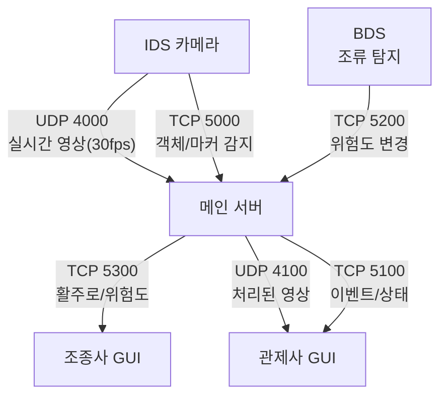

# 통신 가이드

## 개요

### 시스템 목적
본 시스템은 공항 활주로의 안전을 모니터링하기 위한 통합 관제 시스템입니다.
- 활주로 상의 이물질(FOD) 및 사람/차량 감지
- 조류 위험도 모니터링
- 실시간 영상 감시 및 이벤트 알림

### 시스템 동작 원리

#### 1. 영상 처리 흐름
1. IDS 카메라가 30fps로 영상 촬영
2. UDP로 메인 서버에 영상 전송 (포트 4000)
3. 메인 서버의 객체 검출 엔진이 5fps로 처리
   - 처리 속도 차이를 버퍼로 관리 ([상세 설명](detection_buffer_guide.md))
4. 처리된 영상을 관제사 GUI에 전송 (UDP 4100)

#### 2. 이벤트 처리 흐름
1. 객체 감지 시
   - IDS → 서버: 객체 정보 전송 (TCP 5000)
   - 서버 → 관제사 GUI: 이벤트 알림 (TCP 5100)

2. 조류 위험도 변경 시
   - BDS → 서버: 위험도 변경 (TCP 5200)
   - 서버 → 조종사 GUI: 위험도 알림 (TCP 5300)
   - 서버 → 관제사 GUI: 상태 업데이트 (TCP 5100)
   - 위험도 레벨: 1(HIGH), 2(MEDIUM), 3(LOW)

3. 활주로 상태 변경 시
   - 서버: 객체 감지 + 조류 위험도 통합 분석
   - 서버 → 조종사 GUI: 활주로 상태 전송 (TCP 5300)
   - 서버 → 관제사 GUI: 상태 업데이트 (TCP 5100)

### 주요 구성 요소

#### IDS (Intrusion Detection System)
- 역할: 카메라 기반 감시 시스템
- 기능
  - 실시간 영상 전송 (30fps, UDP)
  - 객체 감지 (이물질, 사람, 차량)
  - 마커 인식 (위치 매핑용)

#### BDS (Bird Detection System)
- 역할: 조류 활동 감지 시스템
- 기능
  - 조류 위험도 레벨 관리 (LOW/MEDIUM/HIGH)
  - 실시간 위험도 변경 알림

#### 관제사 GUI
- 역할: 통합 모니터링 인터페이스
- 기능
  - 실시간 영상 표시 (객체 검출 포함)
  - 이벤트 알림 및 로그 관리
  - CCTV/지도 전환
  - 객체 상세 정보 조회

#### 조종사 GUI
- 역할: 활주로 안전 정보 제공
- 기능
  - 활주로 상태 표시
  - 조류 위험도 알림
  - 사용 가능 활주로 정보

### 통신 구조


## 포트 구성
| 포트 | 프로토콜 | 통신 | 용도 |
|------|----------|------|------|
| 4000 | UDP | IDS → 서버 | 영상 전송 |
| 4100 | UDP | 서버 → 관제사 GUI | 영상 전송 |
| 5000 | TCP | IDS ↔ 서버 | 객체/마커 감지 |
| 5100 | TCP | 관제사 GUI ↔ 서버 | 이벤트/명령 |
| 5200 | TCP | BDS ↔ 서버 | 조류 위험도 |
| 5300 | TCP | 조종사 GUI ↔ 서버 | 활주로/위험도 |

## 3. 주요 메시지 형식

### UDP 메시지
- **IDS → 서버**: 카메라 영상 전송
  ```
  포맷: {카메라ID}:{이미지ID}:{바이너리이미지}
  예시: A:1718135772191843820:frame
  
  필드 설명:
  - 카메라ID: 카메라 식별자 ('A' 또는 'B')
  - 이미지ID: 나노초 단위의 프레임 번호 (19자리)
  - 바이너리이미지: OpenCV로 읽은 이미지 데이터
  ```

- **서버 → GUI**: 처리된 영상 전송
  ```
  포맷: {카메라ID}:{바이너리이미지}
  예시: A:frame_box
  
  필드 설명:
  - 카메라ID: 카메라 식별자 ('A' 또는 'B')
  - 바이너리이미지: 객체 검출이 표시된 이미지 데이터
  ```

### TCP 메시지
- **객체 감지**: `type:event, event:object_detected, ...`
- **마커 감지**: `type:event, event:marker_detected, ...`
- **조류 위험도**: `type:event, event:bird_level_changed, ...`
- **관제사 명령**: `M[T]_[C]:[DATA]`
  - T: E(이벤트), C(명령), R(응답)
  - C: OD(객체), BR(조류), MP(지도), CA/CB(CCTV)

## 4. 상세 문서
- [IDS 통신 상세](docs/ids_protocol.md)
- [관제사 GUI 통신 상세](docs/controller_protocol.md)
- [조종사 GUI 통신 상세](docs/pilot_protocol.md)
- [BDS 통신 상세](docs/bds_protocol.md) 